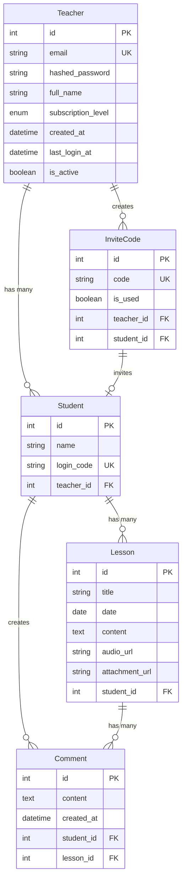

# Tutoria Development Log - August 7, 2025

## 📊 Project Overview

Tutoria is a modern tutoring platform that connects teachers and students, providing collaborative learning tools and seamless content management.

## 🗄️ Database Architecture

### Database Relationship Diagram

### Table Descriptions

#### 1. Teacher Table

- **Primary Function**: Manage teacher accounts and subscription levels
- **Key Fields**:
  - `subscription_level`: Free/Basic/Pro subscription levels
  - `is_active`: Account activation status
  - `last_login_at`: Last login timestamp

#### 2. Student Table

- **Primary Function**: Manage student accounts
- **Key Fields**:
  - `login_code`: Student login code
  - `teacher_id`: Reference to assigned teacher

#### 3. InviteCode Table

- **Primary Function**: Manage invitation codes sent by teachers
- **Key Fields**:
  - `code`: Auto-generated invitation code
  - `is_used`: Usage status
  - `student_id`: Reference to student who used the invitation code

#### 4. Lesson Table

- **Primary Function**: Manage lesson content
- **Key Fields**:
  - `content`: Lesson content
  - `audio_url`: Audio file link
  - `attachment_url`: Attachment file link

#### 5. Comment Table

- **Primary Function**: Manage lesson comments
- **Key Fields**:
  - `content`: Comment content
  - `created_at`: Comment timestamp

## 🔧 Backend Completion Status

### ✅ Completed Features

#### 1. Database Architecture

- [x] SQLAlchemy ORM setup
- [x] Alembic database migrations
- [x] 5 main table models
- [x] Table relationship configuration

#### 2. API Routes

- [x] Authentication APIs (`/api/v1/auth/`)
- [x] Teacher CRUD operations
- [x] Student CRUD operations
- [x] Invitation code management

#### 3. Core Features

- [x] JWT authentication system
- [x] Password hashing
- [x] Invitation code generation mechanism
- [x] Database connection management

#### 4. Development Tools

- [x] Docker containerization
- [x] Poetry dependency management
- [x] Testing framework setup

### 🚧 In Progress Features

- [ ] File upload API
- [ ] Audio processing functionality
- [ ] Lesson content management API
- [ ] Comment system API

## 🎨 Frontend Completion Status

### ✅ Completed Features

#### 1. Page Architecture

- [x] Next.js 15 App Router
- [x] Internationalization support (i18n)
- [x] Responsive design
- [x] TailwindCSS styling system

#### 2. Authentication Pages

- [x] Student registration page (`/auth/student/register`)
- [x] Student login page (`/auth/student/login`)
- [x] Teacher registration page (`/auth/teacher/register`)
- [x] Teacher login page (`/auth/teacher/login`)

#### 3. Dashboard Pages

- [x] Student dashboard (`/dashboard/student`)
- [x] Teacher dashboard (`/dashboard/teacher`)
- [x] Admin page (`/(admin)/admin/teacher/[teacher_id]`)

#### 4. Marketing Pages

- [x] Homepage (`/`)
- [x] Pricing page (`/pricing`)
- [x] Contact page (`/contact`)

#### 5. UI Components

- [x] Form components (LoginForm, RegisterForm)
- [x] Navigation component (Navbar)
- [x] Footer component (Footer)
- [x] Card components (ServiceCard, ToolCard)
- [x] Landing page components (HeroSection, ServiceSection, ToolsSection)

#### 6. Styling Design

- [x] Brand color system
- [x] Gradient background effects
- [x] Shadow effects
- [x] Rounded corner design
- [x] Responsive layout

### 🚧 In Progress Features

- [ ] Dashboard content implementation
- [ ] Lesson management interface
- [ ] File upload functionality
- [ ] Real-time communication features

## 🛠️ Technology Stack

### Backend

- **Framework**: FastAPI
- **Database**: PostgreSQL + SQLAlchemy
- **Authentication**: JWT
- **Containerization**: Docker
- **Dependency Management**: Poetry
- **Migration Tool**: Alembic

### Frontend

- **Framework**: Next.js 14
- **Language**: TypeScript
- **Styling**: TailwindCSS
- **UI Library**: shadcn/ui
- **Internationalization**: next-intl
- **Containerization**: Docker

## 📈 Next Steps Plan

### Short-term Goals (1-2 weeks)

1. Complete file upload API
2. Implement lesson management interface
3. Integrate frontend-backend authentication flow
4. Complete basic CRUD operations

### Medium-term Goals (1 month)

1. Implement real-time communication features
2. Complete audio processing functionality
3. Optimize user experience
4. Increase unit test coverage

### Long-term Goals (2-3 months)

1. Deploy to production environment
2. Performance optimization
3. Security enhancements
4. User feedback integration

## 🎯 Current Priorities

1. **Database Stability**: Ensure all relationships work correctly
2. **API Completeness**: Complete all necessary CRUD operations
3. **Frontend Integration**: Connect frontend to backend APIs
4. **User Experience**: Optimize page loading and interactions

---

_Last Updated: August 7, 2025_
