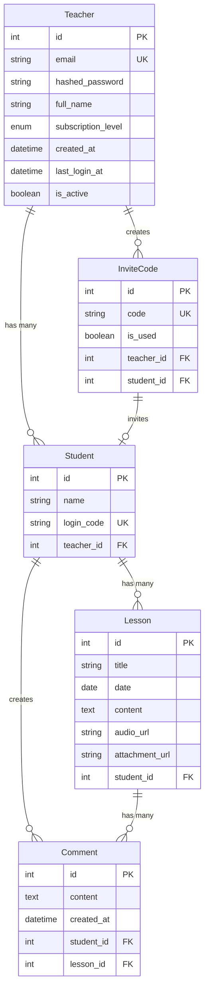

# Tutoria 開發日誌 - 2025 年 8 月 7 日

## 📊 專案概覽

Tutoria 是一個現代化的教學平台，連接教師和學生，提供協作學習工具和無縫內容管理。

## 🗄️ 資料庫架構

### 資料庫關聯圖

### 資料表說明

#### 1. Teacher (教師表)

- **主要功能**: 管理教師帳戶和訂閱等級
- **關鍵欄位**:
  - `subscription_level`: 免費/基礎/專業訂閱等級
  - `is_active`: 帳戶啟用狀態
  - `last_login_at`: 最後登入時間

#### 2. Student (學生表)

- **主要功能**: 管理學生帳戶
- **關鍵欄位**:
  - `login_code`: 學生登入代碼
  - `teacher_id`: 關聯到所屬教師

#### 3. InviteCode (邀請碼表)

- **主要功能**: 管理教師發送的邀請碼
- **關鍵欄位**:
  - `code`: 自動生成的邀請碼
  - `is_used`: 使用狀態
  - `student_id`: 關聯到使用該邀請碼的學生

#### 4. Lesson (課程表)

- **主要功能**: 管理課程內容
- **關鍵欄位**:
  - `content`: 課程內容
  - `audio_url`: 音頻檔案連結
  - `attachment_url`: 附件檔案連結

#### 5. Comment (評論表)

- **主要功能**: 管理課程評論
- **關鍵欄位**:
  - `content`: 評論內容
  - `created_at`: 評論時間

## 🔧 後端完成狀況

### ✅ 已完成功能

#### 1. 資料庫架構

- [x] SQLAlchemy ORM 設定
- [x] Alembic 資料庫遷移
- [x] 5 個主要資料表模型
- [x] 資料表關聯設定

#### 2. API 路由

- [x] 認證相關 API (`/api/v1/auth/`)
- [x] 教師 CRUD 操作
- [x] 學生 CRUD 操作
- [x] 邀請碼管理

#### 3. 核心功能

- [x] JWT 認證系統
- [x] 密碼雜湊處理
- [x] 邀請碼生成機制
- [x] 資料庫連線管理

#### 4. 開發工具

- [x] Docker 容器化
- [x] Poetry 依賴管理
- [x] 測試框架設定

### 🚧 進行中功能

- [ ] 檔案上傳 API
- [ ] 音頻處理功能
- [ ] 課程內容管理 API
- [ ] 評論系統 API

## 🎨 前端完成狀況

### ✅ 已完成功能

#### 1. 頁面架構

- [x] Next.js 15 App Router
- [x] 國際化支援 (i18n)
- [x] 響應式設計
- [x] TailwindCSS 樣式系統

#### 2. 認證頁面

- [x] 學生註冊頁面 (`/auth/student/register`)
- [x] 學生登入頁面 (`/auth/student/login`)
- [x] 教師註冊頁面 (`/auth/teacher/register`)
- [x] 教師登入頁面 (`/auth/teacher/login`)

#### 3. 儀表板頁面

- [x] 學生儀表板 (`/dashboard/student`)
- [x] 教師儀表板 (`/dashboard/teacher`)
- [x] 管理員頁面 (`/(admin)/admin/teacher/[teacher_id]`)

#### 4. 行銷頁面

- [x] 首頁 (`/`)
- [x] 定價頁面 (`/pricing`)
- [x] 聯絡頁面 (`/contact`)

#### 5. UI 元件

- [x] 表單元件 (LoginForm, RegisterForm)
- [x] 導航元件 (Navbar)
- [x] 頁腳元件 (Footer)
- [x] 卡片元件 (ServiceCard, ToolCard)
- [x] 著陸頁元件 (HeroSection, ServiceSection, ToolsSection)

#### 6. 樣式設計

- [x] 品牌色彩系統
- [x] 漸層背景效果
- [x] 陰影效果
- [x] 圓角設計
- [x] 響應式佈局

### 🚧 進行中功能

- [ ] 儀表板內容實作
- [ ] 課程管理介面
- [ ] 檔案上傳功能

## 🛠️ 技術棧

### 後端

- **框架**: FastAPI
- **資料庫**: PostgreSQL + SQLAlchemy
- **認證**: JWT
- **容器化**: Docker
- **依賴管理**: Poetry
- **遷移工具**: Alembic

### 前端

- **框架**: Next.js 14
- **語言**: TypeScript
- **樣式**: TailwindCSS
- **UI 庫**: shadcn/ui
- **國際化**: next-intl
- **容器化**: Docker

## 📈 下一步計劃

### 短期目標 (1-2 週)

1. 完成檔案上傳 API
2. 實作課程管理介面
3. 整合前後端認證流程
4. 完成基本 CRUD 操作

### 中期目標 (1 個月)

1. 實作即時通訊功能
2. 完成音頻處理功能
3. 優化使用者體驗
4. 增加單元測試覆蓋率

### 長期目標 (2-3 個月)

1. 部署到生產環境
2. 效能優化
3. 安全性強化
4. 使用者回饋整合

## 🎯 當前重點

1. **資料庫穩定性**: 確保所有關聯正確運作
2. **API 完整性**: 完成所有必要的 CRUD 操作
3. **前端整合**: 連接前後端 API
4. **使用者體驗**: 優化頁面載入和互動

---

_最後更新: 2025 年 8 月 7 日_
